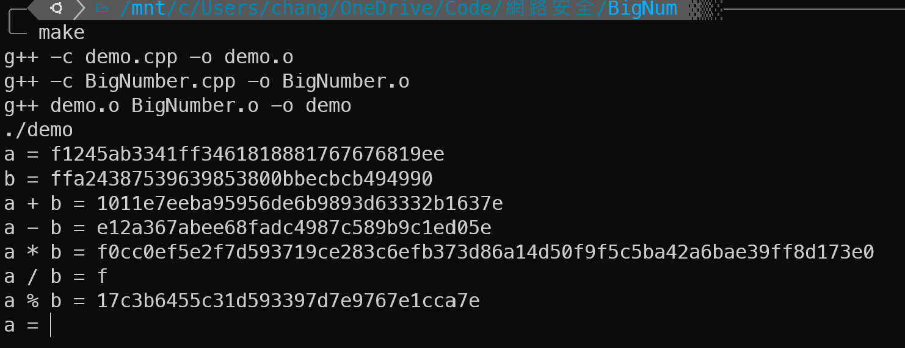
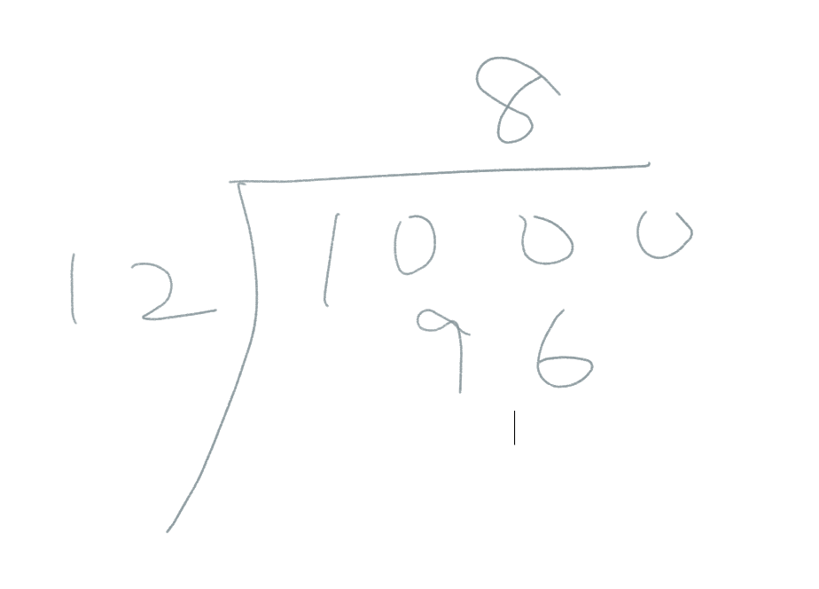
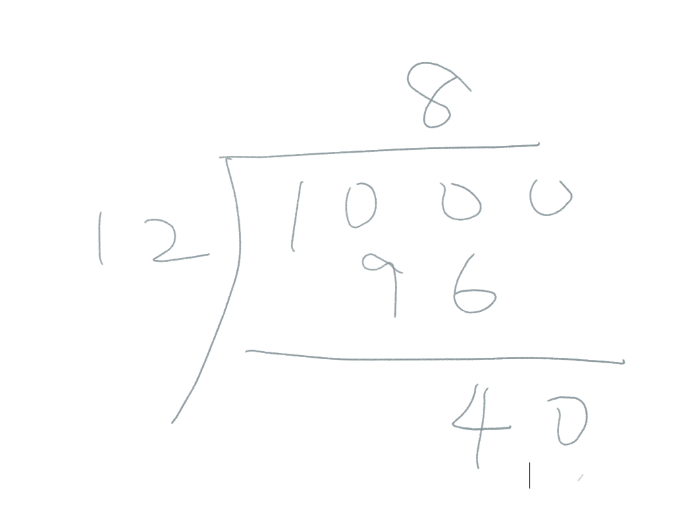
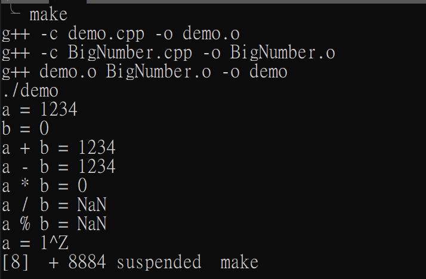

# 網路安全 HW1：BigNumber

## 106021226 蔡皓宇

## 使用說明

使用 make指令可直接 compile and run
若已經compile過，可使用 make run指令
make clean可清除多餘檔案

接著直接輸入 16 進位整數將會自動輸出四則運算的結果

## Output Result


##code 講解

大數運算的主要要點就是使用直式模擬運算，
並將結果儲存成string

直式運算時常碰到的特殊操作「進位」與「借位」
在大數運算的特點是可以先處理完運算後在處裡進位與借位

**Example**
以最複雜的除法作為講解
```c++
void BigNumber::divide(string L, string R, string &out)
{
    vector<string> test(16);
    BigNumber R_big = BigNumber(R);
    //試商 測試每位的除法哪個結果符合
    //透過estimate function 測試哪個值為商
    for (int i = 1; i < 16; i++)
        test[i] = (BigNumber(dectohex(i)) * R_big).getString();
    int deg_1 = L.size();
    int deg_2 = R.size();
    int MAX_deg = deg_1 - deg_2 + 1;
    //example :L = 1234 R = 123
    string temp;
    BigNumber tmp_1, tmp_2, tmp_3;
    for (int i = 0; i < MAX_deg; i++)
    {
        if (L.size() < deg_2) //被除數會越除越小
            break;
        if (i == 0)
            temp.assign(L, 0, deg_2); //temp = 123
        else
            temp.push_back(L[temp.size()]); //each iteration add next digit of L
        if (isStringEqGreater(temp, R))
        {
            int quo = estimate(temp, test);
            out.push_back(dectohex(quo));
            //模擬直式除法，扣掉除數*商
            tmp_1.init(temp);
            tmp_2.init(test[quo]);
            L.erase(0, temp.size());
            tmp_3 = tmp_1 - tmp_2;
            L.insert(0, tmp_3.getString());
            temp = tmp_3.getString();
        }
        else
            out.push_back('0');
    }
    int out_size = out.size();
    for (int i = 0; i < MAX_deg - out_size; i++)
        out.push_back('0');
    while (out[0] == '0')
        out.erase(0, 1);
}
```
其中test[i]為可能的商乘以除數
接著進到estimate function估計，可能的商為多少
以模擬100 / 12 為例 (10進位)

此處的商為8，便是測出小於100但最接近100的 「可能的商」乘以除數

接著用已經寫好的大數除法
將100 - 96
得到直式除法的下一步

下一個迴圈將會繼續測試「可能的商」乘以12 最接近 40 但 小於 40 的值
以此類推，最後完成除法操作。

##例外
除以0的部分
不論是除法還是取餘數
遇到除以0的部分均採用
```c++
//special case
if (divisor.unsigned_string == "0")
{
    return BigNumber("NaN");
}
```
並且在個個運算子的例外判別中加上
```c++
if (this->getString() == "NaN")
    return BigNumber("NaN");
```
因此有NaN出現後，對NaN做任何運算仍會回傳NaN
**output**

##總結
大數運算的要點在於將input的字串或是string轉換成整數陣列，
(於c++用vector實作可以有更多的擴充性與方便性)
此次作業的目標為完成運算子的多載，有利於往後作業使用大數進行操作，
未來有機會可以將其功能擴充，增加"++", "+=", ">"...諸如此類的運子，使其操作更完整更接近int。